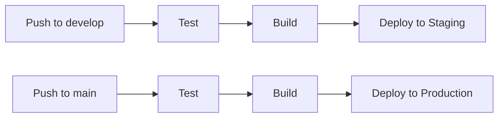

# Personal Website - DevOps Portfolio

A modern, responsive personal portfolio website for Tedo Patsatsia, showcasing DevOps expertise and projects. Built with React, TypeScript, and Tailwind CSS.

## 🚀 Features

- **Modern React Architecture**: Built with React 18, TypeScript, and Vite
- **Responsive Design**: Mobile-first design with Tailwind CSS
- **Dark/Light Theme**: System preference detection with manual toggle
- **Docker Deployment**: Multi-stage builds for development and production
- **CI/CD Pipeline**: Automated GitLab CI/CD with staging and production environments
- **Performance Optimized**: Nginx serving with caching and compression
- **Security Headers**: Comprehensive security configurations
- **Health Checks**: Built-in health monitoring endpoints

## 🛠️ Tech Stack

- **Frontend**: React 18, TypeScript, Tailwind CSS
- **Build Tool**: Vite
- **Icons**: Lucide React
- **Deployment**: Docker, Docker Compose, Nginx
- **CI/CD**: GitLab CI/CD
- **Server**: Debian 12

## 🏗️ Project Structure

```
personal-website-devops/
├── src/
│   ├── components/          # React components
│   ├── data/               # Static data files
│   ├── App.tsx             # Main app component
│   └── main.tsx            # Entry point
├── deploy/                 # Deployment scripts
├── docker-compose.yml      # Local development
├── docker-compose.prod.yml # Production deployment
├── Dockerfile              # Production image
├── Dockerfile.dev          # Development image
├── nginx.conf              # Nginx configuration
└── .gitlab-ci.yml          # CI/CD pipeline
```

## 🚀 Quick Start

### Local Development

1. **Clone the repository**
   ```bash
   git clone <your-gitlab-repo-url>
   cd personal-website-devops
   ```

2. **Install dependencies**
   ```bash
   npm install
   ```

3. **Start development server**
   ```bash
   npm run dev
   ```

4. **Or use Docker for development**
   ```bash
   docker-compose up dev
   ```

### Local Testing with Docker

```bash
# Build and run production image locally
docker-compose up prod

# Access the application at http://localhost:8080
```

## 🐳 Docker Deployment

### Prerequisites

- Docker and Docker Compose installed
- Debian 12 server (recommended)
- GitLab repository with Container Registry enabled

### Server Setup

1. **Run the server setup script**
   ```bash
   chmod +x deploy/server-setup.sh
   ./deploy/server-setup.sh
   ```

2. **Set up GitLab Runner (optional, for self-hosted runners)**
   ```bash
   chmod +x deploy/gitlab-runner-setup.sh
   ./deploy/gitlab-runner-setup.sh
   ```

### Manual Deployment

1. **Clone repository on server**
   ```bash
   git clone <your-gitlab-repo-url> /opt/personal-website
   cd /opt/personal-website
   ```

2. **Build and deploy**
   ```bash
   docker-compose -f docker-compose.prod.yml up -d
   ```

3. **Check deployment**
   ```bash
   curl http://localhost/health
   ```

## 🔄 CI/CD Pipeline

The GitLab CI/CD pipeline includes:

### Stages

1. **Test**: Linting and build verification
2. **Build**: Docker image creation and registry push
3. **Deploy Staging**: Automatic deployment to staging environment
4. **Deploy Production**: Manual deployment to production

### Environment Variables

Configure these variables in GitLab CI/CD settings:

#### Registry & Authentication
- `CI_REGISTRY_USER`: GitLab registry username
- `CI_REGISTRY_PASSWORD`: GitLab registry password

#### Staging Environment
- `STAGING_SERVER`: Staging server IP/hostname
- `STAGING_USER`: SSH username for staging server
- `STAGING_SSH_PRIVATE_KEY`: SSH private key for staging access

#### Production Environment
- `PRODUCTION_SERVER`: Production server IP/hostname
- `PRODUCTION_USER`: SSH username for production server
- `PRODUCTION_SSH_PRIVATE_KEY`: SSH private key for production access
- `PRODUCTION_DOMAIN`: Production domain name

### Pipeline Workflow



## 🔒 Security Features

- **Security Headers**: XSS protection, content type options, frame options
- **Content Security Policy**: Restrictive CSP for enhanced security
- **Fail2Ban**: Intrusion prevention system
- **UFW Firewall**: Configured for necessary ports only
- **Docker Security**: Non-root containers, minimal attack surface

## 📊 Monitoring & Health Checks

- **Health Endpoint**: `/health` for application monitoring
- **Docker Health Checks**: Built-in container health monitoring
- **Log Rotation**: Automated log management
- **Watchtower**: Optional automatic updates

## 🔧 Configuration

### Environment Variables

```bash
# Production
NODE_ENV=production

# Development
NODE_ENV=development
VITE_API_URL=http://localhost:3000
```

### Nginx Configuration

The nginx configuration includes:
- Gzip compression
- Static asset caching
- Security headers
- SPA routing support

## 📝 Available Scripts

```bash
# Development
npm run dev          # Start development server
npm run build        # Build for production
npm run lint         # Run ESLint
npm run preview      # Preview production build

# Docker
docker-compose up dev     # Development with Docker
docker-compose up prod    # Production with Docker
```

## 🚀 Deployment Commands

```bash
# Manual deployment
./deploy.sh

# Service management
sudo systemctl start personal-website
sudo systemctl stop personal-website
sudo systemctl restart personal-website
sudo systemctl status personal-website

# Docker management
docker-compose -f docker-compose.prod.yml logs
docker-compose -f docker-compose.prod.yml down
docker-compose -f docker-compose.prod.yml up -d
```

## 🔍 Troubleshooting

### Common Issues

1. **Docker permission denied**
   ```bash
   sudo usermod -aG docker $USER
   # Log out and log back in
   ```

2. **Port already in use**
   ```bash
   sudo lsof -i :80
   sudo systemctl stop apache2  # or nginx
   ```

3. **GitLab Runner not working**
   ```bash
   sudo gitlab-runner verify
   sudo gitlab-runner restart
   ```

### Logs

```bash
# Application logs
docker-compose -f docker-compose.prod.yml logs -f

# System logs
sudo journalctl -u personal-website -f

# GitLab Runner logs
sudo journalctl -u gitlab-runner -f
```

## 📚 Contributing

1. Fork the repository
2. Create a feature branch
3. Make your changes
4. Test locally with Docker
5. Submit a pull request

## 📄 License

This project is licensed under the MIT License.

## 🤝 Support

For issues and questions:
1. Check the troubleshooting section
2. Review GitLab CI/CD logs
3. Check Docker container logs
4. Create an issue in the repository

---

**Built with ❤️ by Tedo Patsatsia** 